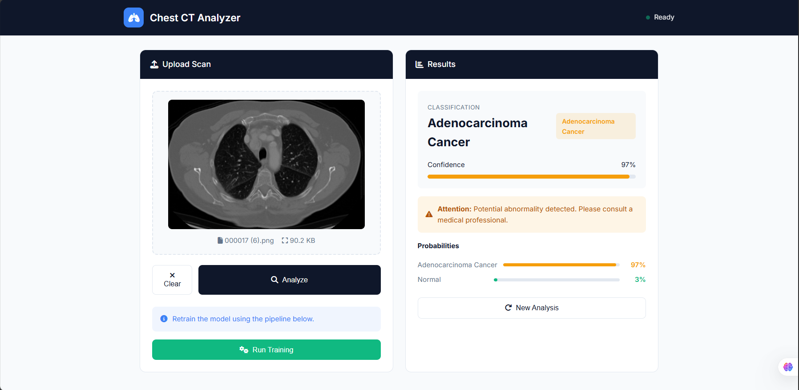

# mlops-chest-cancer-classification

End-to-end MLOps pipeline for chest-image classification. The classifier is the payload; the
engineering focus is the delivery path around it — reproducible stages, versioned data and models,
and a deployment that can be rebuilt from the repository state rather than reconstructed by hand.

**Pipeline:** configuration → data ingestion → base model preparation → training → evaluation →
deployment, each stage declared in `dvc.yaml`.

**Stack:** MLflow for experiment tracking (hosted on DagsHub), DVC for data and model versioning,
Docker for packaging, GitHub Actions for CI/CD, and AWS ECR + EC2 for deployment. The EC2 instance
runs as a self-hosted GitHub Actions runner, so a push to `main` rebuilds the image, pushes it to
ECR, and redeploys the container.

## Running system

Screenshots from the deployed application on EC2.

| | |
|---|---|
|  |  |
|  |  |

The deployed interface, the upload path, and a prediction returned by the served model. A screen
recording of the full flow is kept outside the repository for size reasons.

## Workflows

1. Update config.yaml -
2. Update secrets.yaml (optional) -
3. Update params.yamls -
4. Update the entity -
5. Update the configuration manager in src config -
6. Update the components
7. Update the pipeline
8. Update the main.py
9. Update the dvc.yaml

## MLflow

- [Documentation](https://mlflow.org/docs/latest/index.html)


##### cmd
- mlflow ui

### dagshub
[dagshub](https://dagshub.com/)

MLFLOW_TRACKING_URI=https://dagshub.com/Abdullah2240/mlops-chest-cancer-classification.mlflow \
MLFLOW_TRACKING_USERNAME=Abdullah2240 \
MLFLOW_TRACKING_PASSWORD=<YOUR_SECRET_TOKEN> \
python script.py

Run this to export as env variables:

```bash

export MLFLOW_TRACKING_URI=https://dagshub.com/Abdullah2240/mlops-chest-cancer-classification.mlflow

export MLFLOW_TRACKING_USERNAME=Abdullah2240

export MLFLOW_TRACKING_PASSWORD=<YOUR_SECRET_TOKEN>

```

### DVC cmd

1. dvc init
2. dvc repro
3. dvc dag


## About MLflow & DVC

MLflow

 - Its Production Grade
 - Traces all of your expriements
 - Logging & taging your model


DVC 

 - Its very lite weight for POC only
 - light weight expriements tracker
 - It can perform Orchestration (Creating Pipelines)


# AWS-CICD-Deployment-with-Github-Actions

## 1. Login to AWS console.

## 2. Create IAM user for deployment

	#with specific access

	1. EC2 access : It is virtual machine

	2. ECR: Elastic Container registry to save your docker image in aws


	#Description: About the deployment

	1. Build docker image of the source code

	2. Push your docker image to ECR

	3. Launch Your EC2 

	4. Pull Your image from ECR in EC2

	5. Lauch your docker image in EC2

	#Policy:

	1. AmazonEC2ContainerRegistryFullAccess

	2. AmazonEC2FullAccess

	
## 3. Create ECR repo to store/save docker image
    - Save the URI: URI:
    

	
## 4. Create EC2 machine (Ubuntu) 

## 5. Open EC2 and Install docker in EC2 Machine:
	
	
	#optinal

	sudo apt-get update -y

	sudo apt-get upgrade
	
	#required

	curl -fsSL https://get.docker.com -o get-docker.sh

	sudo sh get-docker.sh

	sudo usermod -aG docker ubuntu

	newgrp docker
	
# 6. Configure EC2 as self-hosted runner:
    setting>actions>runner>new self hosted runner> choose os> then run command one by one


# 7. Setup github secrets:

    AWS_ACCESS_KEY_ID=

    AWS_SECRET_ACCESS_KEY=

    AWS_REGION = us-east-1

    AWS_ECR_LOGIN_URI = 

    ECR_REPOSITORY_NAME = 
